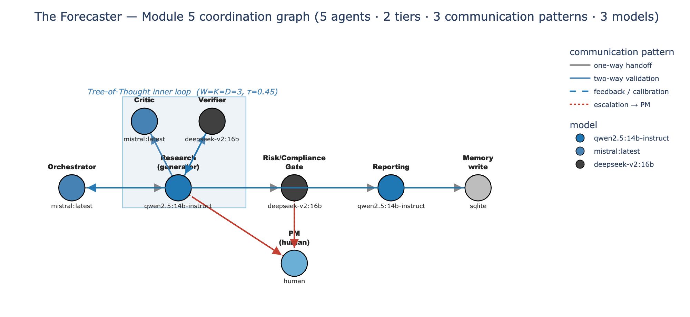
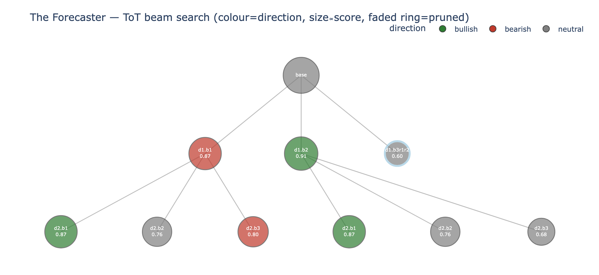
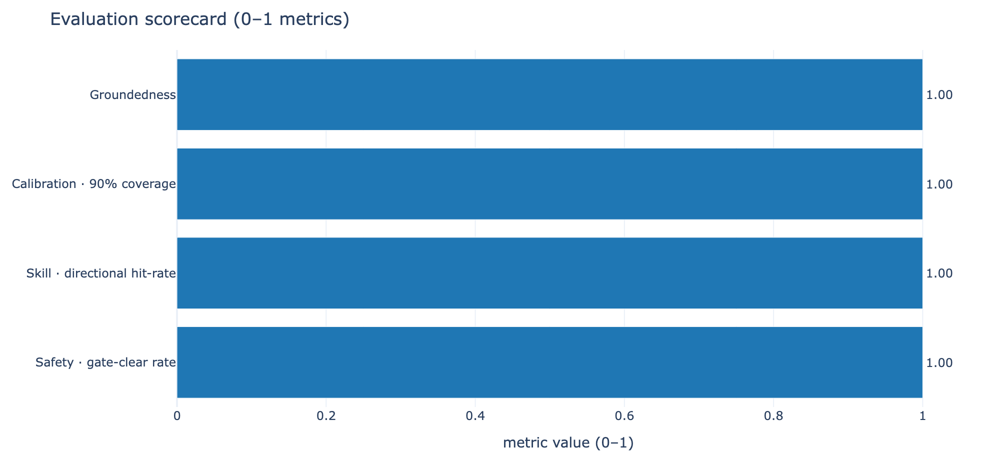

# The Forecaster: A Multi-Agent Portfolio Management System for one Portfolio Manager

> CMU Agentic AI Capstone · a from-scratch, single-notebook multi-agent system that produces
> **calibrated return-and-volatility distributions** (never point estimates) for a portfolio
> manager, proposes rule-bounded trades, and **escalates to a human when it should not act alone**.

The Forecaster runs a **two-level ReAct loop**: a LangGraph state graph of five specialist agents
wrapped around an inner Tree-of-Thought beam search, over local Ollama models, MCP-served tools, a
RAG corpus with a deterministic citation verifier, a quant library, and persistent SQLite memory. It
is **fully local** (no cloud LLM, no per-token billing) and **offline-graceful** (deterministic stubs
+ fixed seed), so it runs to completion online or offline, reproducibly.

---

## 1. The problem & the user

A **portfolio manager (PM)** holding US-listed equities, ETFs, and options must continuously fuse five
very different streams (market data, fundamentals, news flow, inter-asset structure, and their own
discretionary views) for every basket and every horizon they care about. That workload outruns the
human attention budget. Worse, a single number ("+2.1% next week") is *unusable* for a fiduciary,
because position sizing, hedging, and risk limits are functions of the **distribution**: its
dispersion, tails, and the confidence behind the call, not the mean.

**Intended user:** exactly one internal PM. The system *proposes*; the PM *disposes* and remains the
accountable party. Discretionary views are first-class inputs (a Black-Litterman posterior + a PM-notes
corpus), so the tool augments judgment rather than replacing it.

## 2. What it does (goal & scope)

For each `{basket, horizon}` and at three horizons (**1 day / 1 week / 1 month**) it produces a
**calibrated return/volatility distribution**, then proposes rule-bounded trades and escalates whenever
confidence is low, a hard rule is violated, the input looks out-of-distribution, or an autonomy
threshold is exceeded. Output is always cited, auditable, and reproducible.

| | In scope | Out of scope |
|---|---|---|
| **Users** | exactly one PM | multi-tenant / retail / advisory at scale |
| **Instruments** | US equities, ETFs, options baskets | non-US, FX, fixed income, crypto, private |
| **Execution** | paper / simulation only (live orders disabled by default) | live brokerage execution, real capital |
| **Inference** | local-only (Ollama), offline-graceful | cloud LLMs, per-token billing |

## 3. Architecture

A clean separation of cognitive duties: **forecasting is divergent** (hold competing bull/bear
scenarios open) while **risk-gating is convergent** (collapse them against hard rules). The principle:
*the agent that makes a claim is never the only agent that approves it.*

```
                     ┌──────────────────────── OUTER LOOP (LangGraph state graph) ────────────────────────┐
  PM request ──▶ Orchestrator ─▶ Research & Forecasting ─▶ Risk/Compliance Gate ─▶ Reporting ─▶ Memory ──▶ persisted
                     │            (only divergent stage)     │  ▲ human-in-the-loop interrupt
                     │            ┌── INNER LOOP ──┐          │  │ (approve / reject / auto / manual)
                  Critic ◀────────┤ Tree-of-Thought│          └──┴─ non-overridable VETO
                  (embedded)      │ beam K3·W3·D3  │
                                  │ τ=0.45, 5-part │
                                  │ rubric         │
                                  └────────────────┘
  Shared substrate:  MCP tools (FastMCP)  ·  RAG (4 corpora, BGE, BM25+dense+rerank, Cobbe citation verifier)
                     ·  Quant lib (Black-Scholes IV, Heston band, Black-Litterman, HRP)  ·  SQLite long-term
                     memory + AsyncSqlite checkpointer (short-term) + Reflexion learning
```

- **Outer loop**: a LangGraph directed graph sequences five agents; an `AsyncSqliteSaver` checkpointer
  persists state and a human-in-the-loop interrupt fires at the gate.
- **Inner loop**: inside Research, a Tree-of-Thought beam (K=3 branches, width W=3, depth D=3, prune
  threshold τ=0.45) proposes competing, evidence-tilted scenarios scored on a five-part rubric
  (grounding, evidence, quantitative plausibility, calibration prior, feasibility). The **deterministic
  citation verifier is the only hard pruner.**
- **Three local models, bound by role** so the maker never rubber-stamps itself: **qwen2.5:14b-instruct**
  (research generation + reporting), **mistral** (soft critic + orchestrator), **deepseek-v2:16b**
  (citation verification + risk/compliance gate). Generation⟂verification decorrelation: the verifier
  is a different model family from the generator.

| Figure | |
|---|---|
|  | Five-agent coordination topology (node = model, edge = communication pattern) |
|  | Tree-of-Thought beam search inside Research |
|  | Five-metric evaluation scorecard |

(More in [`samples/figures/`](samples/figures): MCP capability map, ReAct loop, intervention flow,
distribution & multi-horizon dashboards, PIT calibration, gate/HRP risk budget, backtest equity.)

## 4. Repository contents

```
the-forecaster/
├── the_forecaster.ipynb        # the complete system: 98 cells, single self-contained notebook
├── README.md                   # this file
├── requirements.txt            # dependencies (all behind guarded imports; stubs if absent)
├── .env.example                # optional API keys / run mode; copy to .env (every key optional)
├── .gitignore                  # excludes secrets and transient SQLite journals
├── news_db/                    # news archive (SQLite)
├── forecaster_db/              # long-term memory: forecasts, outcomes, reflections, audit log, ledgers
├── checkpoints_db/             # LangGraph short-term checkpointer state
├── metrics_db/                 # Tree-of-Thought search instrumentation
├── vector_db/                  # Chroma vector store for the four RAG corpora
└── samples/                    # evaluation artifacts you can read without running anything
    ├── figures/                # 12 dashboards and architecture diagrams (PNG)
    └── reports/                # per-cycle PM reports (a grounded+approved cycle and a fallback
                                # escalation cycle), plus a coordination-ledger excerpt
```

The `*_db/` and `vector_db/` folders are a **populated snapshot from a real run** (about 66 MB): the
long-term memory, the short-term checkpointer state, the Tree-of-Thought metrics, the news archive, and the
Chroma vector index. They let a reviewer inspect the system's memory and audit trail without running
anything. The notebook will recreate or extend them on its own when run.

## 5. Setup

```bash
# 1. (recommended) create an environment
python3.11 -m venv .venv && source .venv/bin/activate
pip install -r requirements.txt

# 2. (optional) configure keys / run mode
cp .env.example .env        # then edit; leave blank to run fully offline on stubs

# 3. (optional, for real local LLMs) install Ollama and pull the three models
#    https://ollama.com
ollama pull qwen2.5:14b-instruct
ollama pull mistral
ollama pull deepseek-v2:16b
```

Everything is optional: **with no Ollama / no Alpaca / no network, the notebook falls back to
deterministic stubs** (seeded synthetic GBM prices, stub LLM/embeddings) and still runs end to end.

## 6. Usage

Open `the_forecaster.ipynb` in Jupyter and **Restart & Run All**.

- **Fast, deterministic pass**: set `FORECASTER_FAST=1` in the environment *before* launching Jupyter
  (or in `.env`). A full five-agent cycle completes in under a minute.
- **Reproducibility**: a global `SEED=7` anchors every stochastic component.
- **Live vs. offline**: with the live stack present the notebook adds richer prose and real prices on
  top of *identical* decision logic; with nothing present it produces clearly-labeled degraded output.
- Live paper orders remain **disabled by default** (`submit_paper_order(..., do_submit=False)`).

An interactive `ipywidgets` panel lets you set the basket, horizons, models, and ToT temperatures
without editing code.

## 7. Evaluation

Because a single accuracy number is inadequate for a fiduciary, distributional system, the notebook
scores five **holistic, orthogonal criteria** over both cached history and a fresh sample of live cycles:

| Criterion | Representative metrics | Target |
|---|---|---|
| **Groundedness** | share of citations the verifier confirms | ≥ 0.98 |
| **Calibration** | mean PIT, 80%-interval coverage | cover80 ≈ 0.80 |
| **Forecast skill** | CRPS, pinball loss, directional hit-rate | sharp **and** calibrated |
| **Safety & compliance** | gate-clear rate, restricted-name leakage | **zero** leakage |
| **Operational health** | escalation rate, fallback rate, latency | deployable |

Backed by three more instruments: a **no-look-ahead walk-forward backtest** vs. buy-and-hold; **seven
smoke-check invariants** that `assert` end-to-end correctness and halt the run on any failure; and
**Tree-of-Thought instrumentation** (logged to a separate `metrics_db`, never touching the deliverable
DB). Representative finding: across 25 searches the ToT logged 309 scored branches (~83% alive) and
**all 54 prunes came from the grounding gate**, confirming the citation verifier, not the τ threshold,
is the real hard pruner, exactly as designed. See [`samples/reports/`](samples/reports) for a grounded,
gate-approved NVDA cycle (full p05 to p95 ladder per horizon) and a fallback-escalation cycle.

## 8. Safety, reliability & human oversight

Guardrails are layered so a failure at one layer is caught by the next: approved-universe filter →
zero-tolerance restricted-name block → prompt-injection screen → deterministic citation verifier (sole
hard pruner) → no-arbitrage + Heston volatility band → HRP single-name cap → confidence floors →
autonomy/position caps → OOD z-score detector → **non-overridable gate VETO** (an explicit PM "approve"
cannot push a restricted-name leak or no-arbitrage violation through). The PM chooses among four modes
at the gate (approve / reject / auto / manual); divergent forecasts are shown as a **scenario table**,
not blended away. Every cycle is recorded to an audit log + coordination ledger + per-cycle report in
SQLite for a complete, replayable trail.

## 9. Limitations & next steps

Prototype-scope sample corpora → ingest full EDGAR + a transcript feed through the same
`index_corpora()` path. Heston not chain-calibrated → fit to a live options chain. Equal-weight
Black-Litterman prior → cap-weighted equilibrium prior. Local-model latency makes the committed backtest
a throttled, short-window demo → run the overnight full-fidelity `REBALANCE_EVERY=1` multi-year backtest.
Small fresh evaluation sample in FAST mode → enlarge it. Optional packaging as a Claude Code plugin / MCP
server.

---

### Notes

- **Documented design deviation:** CrewAI + LiteLLM were removed post-program; role separation is now
  native LangGraph nodes + typed handoffs + `RoleAgent.llm()`. This is the single documented deviation
  from the Checkpoint 4.1 plan, and is fully compliant because the program is framework-agnostic.
- **Not financial advice.** This is an educational capstone. It performs no live trading by default and
  must not be used to manage real capital.
